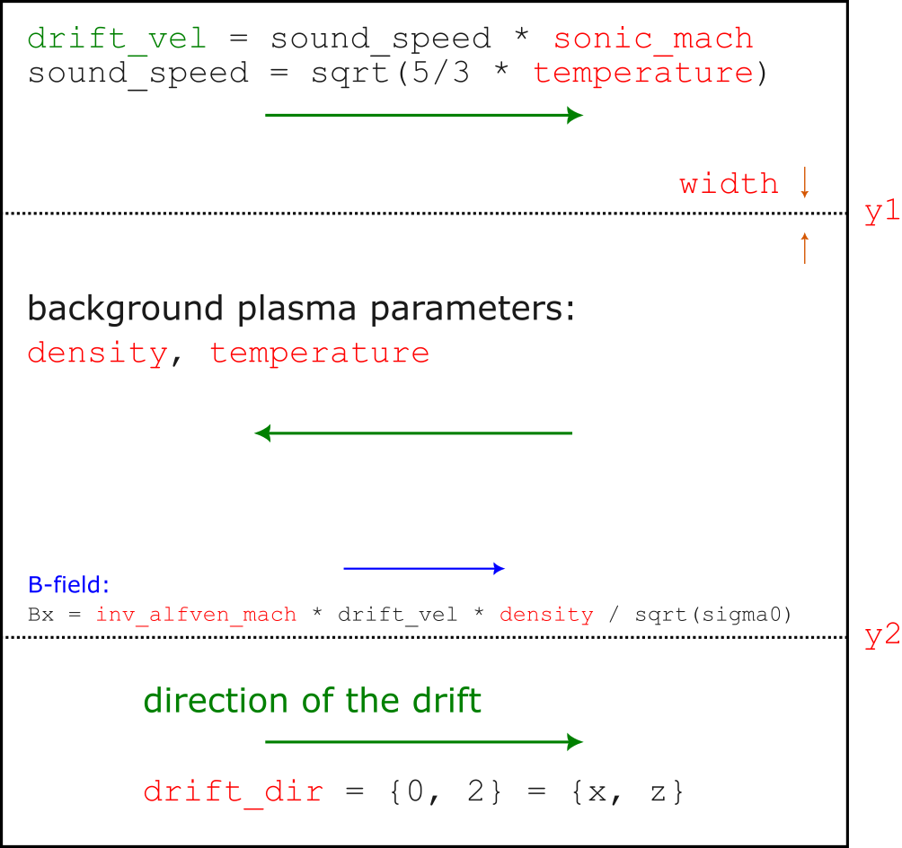

# Kelving-Helmholtz instability

## Setup input parameters

- `temperature` [float]: temperature of the background plasma (default: `0.01`)
- `sonic_mach` [float]: sonic mach number of the bulk motion (default: `1.0`)
- `density` [float]: density of the background plasma in units of $n_0$ (default: `1.0`)
- `drift_dir` [int]: drift direction: 0 or 2 corresponds to $x$ or $z$ (default: `0`)
- `width` [float]: width of the transition region (default: `0.01`)
- `y1`, `y2` [float]: positions of transition regions (default: `-0.25` and `0.25`)
- `inv_alfven_mach` [float]: inverse of the Alfvenic mach number, used to initialize $B_x$ (default: `0.0`, i.e. no B-field)

